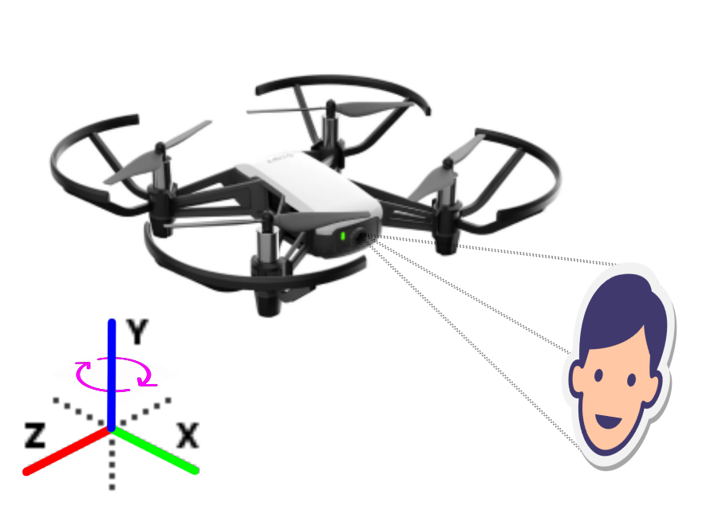
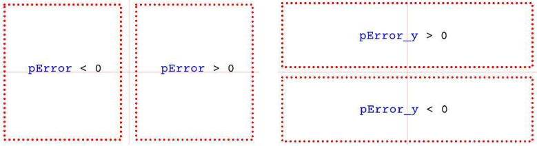

# Tello Drone Face Tracker

:star: Allows **autonomous** flight by processing the images taken with Tello

:white_check_mark: **OpenCV** Haar feature-based cascade classifiers used for face detection

:white_check_mark: [DJITelloPy](https://pypi.org/project/djitellopy) Python library used for communication between computer and Tello

:white_check_mark: **6 DOF** (Six Degrees of Freedom) maneuverable

:white_check_mark: [PID](https://en.wikipedia.org/wiki/PID_controller) (proportional–integral–derivative) controller used for stabilization

:white_check_mark: `pError` controls the x-axis, `pError_y` controls the y-axis

:point_right: DJI Tello [official site](https://store.dji.com/shop/tello-series)
